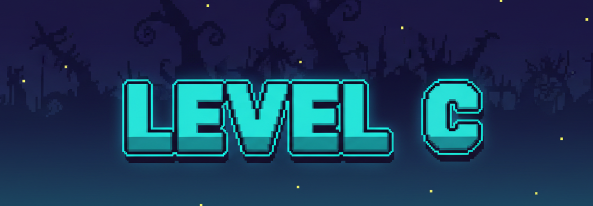

# 😈 Level C

**"Um remake 2D do 'Level Devil' (mas em C)"**


Level C é um jogo de plataforma 2D do gênero *rage* (feito para passar raiva), inspirado no notório **Level Devil**.  
O objetivo é simples: superar obstáculos, armadilhas e alcançar o portal de saída em cada nível.

O jogo foi desenvolvido em **C puro** utilizando a biblioteca gráfica **Raylib** para a disciplina de *Programação Imperativa Formativa (PIF)* na CESAR School.

---

## 👥 Equipe de Desenvolvimento

Projeto desenvolvido por:

- Guilherme Tolentino Leitão De Melo  
- João Eduardo Azevedo de Andrade
- Rafael Coutinho Lima

---

## 🎬 Vídeo Demonstrativo

Confira o screencast do jogo e veja as mecânicas (e o sofrimento) em ação:

🎥 **Screencast no YouTube:**  
👉[LINK do SCREEN CAST](https://youtu.be/BTZFCk2sp9Q)

---

## 🛠️ Compilando e Rodando

### ✅ Instale as Dependências (Raylib)

### 🔸 Linux (Ubuntu/Debian)

```bash
# Atualizar repositórios
sudo apt update

# Instalar ferramentas de build
sudo apt install build-essential git

# Instalar Raylib (já inclui todas as dependências necessárias)
sudo apt install libraylib-dev
```

#### 🔸 macOS

Antes de seguir o guia oficial, tente o método mais simples:

```bash
brew install raylib
```

⚠️ O jogo não foi testado no sistema Mac.

💡 *Se estiver usando outra distribuição ou SO (Windows), consulte o Guia Oficial da Raylib.*
---

### 📥 Clone o repositório

    git clone github.com/RafaelCoutinhoLima/Level_C
    cd Level_C

---

### ▶️ Compile e execute o jogo
Dentro da pasta do projeto:

#### Usando Makefile:

    make clean && make run

---

## 🎮 Como Jogar
O objetivo é guiar o personagem até o portal de saída se livrando de todos os obstáculos.

### 🕹️ Controles
- ⬅️ **A / ←** — mover para a esquerda 
- ➡️ **D / →** — mover para a direita  
- ⬆️ **W / ↑ / Espaço** — pular  

### 🦘 Mecânica de Pulo
A altura do pulo é dinâmica: segure para pular mais alto, toque rápido para pulo curto.

### 🎯 Objetivo
- Alcance o portal no final de cada nível.
- Evite armadilhas mortais
- Complete todos os níveis disponíveis.

---

## 🗺️ Elementos do Jogo

### 🟪 Plataformas (Roxo Escuro)
Blocos sólidos que formam o chão e paredes do nível.

### 🔶 Espinhos (Laranja)
**Armadilha mortal!** Ao tocar, você morre e retorna ao início.

### 🟪 Blocos Falsos (Roxo Escuro)
Parecem plataformas normais, mas **desaparecem** quando você pisa.

### ⬛ Plataformas Unidirecionais (Preto)
Barra preta que permite pular através de baixo para cima, mas não de cima para baixo.

### 🌸 Portal (Magenta/Rosa)
**Meta do nível!** Alcance-o para completar a fase e desbloquear a próxima.

---


